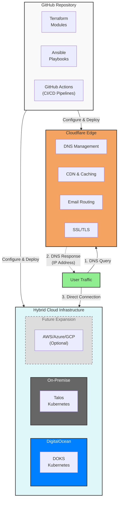

# Hybrid Cloud Kubernetes Infrastructure

> Infrastructure as Code for managing hybrid cloud Kubernetes environments using Terraform, Ansible, and GitHub Actions

[](https://www.terraform.io/)
[](https://www.ansible.com/)
[](https://kubernetes.io/)
[](https://github.com/features/actions)

## Overview

This repository contains Infrastructure as Code (IaC) for deploying and managing a hybrid cloud Kubernetes-centric infrastructure across multiple cloud providers and on-premise environments. It leverages:

- **Terraform** for infrastructure provisioning and declarative configuration
- **Ansible** for configuration management, automation, and routine operational tasks
- **GitHub Actions** for CI/CD pipeline automation with integrated secret management
- **Kubernetes** for container orchestration across hybrid cloud environments

### Design Goals

- **Vendor Neutrality**: Avoid cloud provider lock-in through abstraction layers
- **Infrastructure as Code**: All infrastructure versioned and managed as code
- **Automation First**: Minimize manual operations through comprehensive automation
- **Security by Default**: Implement security best practices at every layer
- **Hybrid Cloud Ready**: DigitalOcean cloud + on-premise with future multi-cloud expansion capability
- **GitOps Workflow**: Changes deployed through version-controlled pull requests

## Architecture



### Edge Services (Cloudflare Free Plan)

- **DNS Management**: Authoritative DNS for all domains with DNSSEC
- **Email Routing**: Forward emails to personal addresses (no mail server needed)
- **SSL/TLS**: Universal SSL certificates with automatic renewal
- **CDN**: Global content delivery with unlimited bandwidth
- **DDoS Protection**: Unmetered protection against distributed attacks
- **R2 Object Storage**: Terraform state storage with versioning and locking (10GB free, zero egress)
- **Workers**: Serverless edge computing (100,000 requests/day free)
- **Security**: Web Application Firewall (WAF) and rate limiting

**Terraform State Management**: State files are stored in Cloudflare R2 with native locking support,
providing zero-cost state storage with high durability. See
[ADR-0014: Cloudflare R2 for Terraform State Storage](docs/decisions/0014-cloudflare-r2-terraform-state.md)
for details.

See [ADR-0004: Cloudflare DNS and Services](docs/decisions/0004-cloudflare-dns-services.md)
for the decision rationale and [Cloudflare Services Specification](specs/cloudflare/cloudflare-services.md)
for detailed configuration.

## Quick Start

### Prerequisites

- **Terraform** >= 1.6.0
- **Ansible** >= 2.15.0
- **kubectl** >= 1.28.0
- **Git** >= 2.40.0
- **GitHub CLI** (`gh`) >= 2.30.0
- **DigitalOcean CLI** (`doctl`) >= 1.100.0
- **Talos CLI** (`talosctl`) >= 1.6.0 (for on-premise clusters)

### Installation

```bash
# Clone the repository
git clone https://github.com/shangkuei/infrastructure.git
cd infrastructure

# Install required tools (macOS)
brew install terraform ansible kubectl gh

# Install required tools (Linux)
# See docs/setup/installation.md for platform-specific instructions

# Verify installations
terraform version
ansible --version
kubectl version --client
```

### Initial Setup

1. **Configure cloud provider credentials**:

   ```bash
   # DigitalOcean
   doctl auth init

   # Talos (for on-premise)
   # Download talosctl from https://www.talos.dev/
   ```

2. **Set up GitHub secrets** (for CI/CD):

   ```bash
   # Set DigitalOcean credentials
   gh secret set DIGITALOCEAN_TOKEN

   # Set Cloudflare credentials
   gh secret set CLOUDFLARE_API_TOKEN

   # Set Terraform variables
   gh secret set TF_VAR_database_password
   gh secret set TF_VAR_api_key

   # Set Ansible Vault password
   gh secret set ANSIBLE_VAULT_PASSWORD
   ```

3. **Initialize Terraform**:

   ```bash
   cd terraform/environments/dev
   terraform init
   ```

4. **Configure Ansible inventory**:

   ```bash
   cp ansible/inventory/sample.yml ansible/inventory/production.yml
   # Edit ansible/inventory/production.yml with your hosts
   ```

### Deploy Development Environment

```bash
# Navigate to dev environment
cd terraform/environments/dev

# Validate configuration
terraform validate

# Plan infrastructure changes
terraform plan -out=tfplan

# Review plan and apply
terraform show tfplan
terraform apply tfplan

# Deploy applications with Ansible
cd ../../../ansible
ansible-playbook -i inventory/dev playbooks/deploy/app.yml
```

## Repository Structure

```text
infrastructure/
├── terraform/              # Terraform configurations
│   ├── modules/           # Reusable modules
│   ├── environments/      # Environment-specific configs
│   └── providers/         # Cloud provider configurations
│
├── ansible/               # Ansible automation
│   ├── playbooks/        # Automation playbooks
│   ├── roles/            # Reusable roles
│   └── inventory/        # Host inventories
│
├── .github/              # GitHub Actions workflows
│   └── workflows/        # CI/CD pipelines
│
├── docs/                 # Documentation
│   ├── decisions/       # Architectural Decision Records
│   ├── research/        # Research and analysis
│   ├── runbooks/        # Operational procedures
│   └── architecture/    # Architecture diagrams
│
├── specs/               # Technical specifications
│   ├── network/        # Network specs
│   ├── security/       # Security requirements
│   ├── compute/        # Compute specs
│   └── storage/        # Storage specs
│
├── scripts/            # Utility scripts
├── tests/              # Automated tests
├── AGENTS.md           # AI assistant guidance
├── CLAUDE.md          # Claude Code specific guidance
└── README.md          # This file
```

## Environments

### Development

- **Purpose**: Testing and experimentation
- **Auto-Deploy**: Yes (on merge to `develop`)
- **Cost Optimization**: Aggressive (stop resources overnight)
- **Data**: Sample/synthetic data only

### Staging

- **Purpose**: Pre-production validation
- **Auto-Deploy**: No (manual trigger)
- **Cost Optimization**: Moderate
- **Data**: Anonymized production data

### Production

- **Purpose**: Live workloads
- **Auto-Deploy**: No (requires approval)
- **Cost Optimization**: Reserved instances
- **Data**: Production data with encryption

## Common Operations

### Infrastructure Management

```bash
# Plan changes (dry-run)
terraform plan -var-file=environments/production/terraform.tfvars

# Apply approved changes
terraform apply -var-file=environments/production/terraform.tfvars

# View current state
terraform show

# Import existing resources
terraform import module.network.digitalocean_vpc.main vpc-uuid-here
```

### Configuration Management

```bash
# Run playbook with check mode
ansible-playbook -i inventory/production playbooks/deploy/app.yml --check

# Deploy application
ansible-playbook -i inventory/production playbooks/deploy/app.yml

# Run maintenance tasks
ansible-playbook -i inventory/production playbooks/maintenance/update.yml

# Troubleshoot issues
ansible-playbook -i inventory/production playbooks/troubleshoot/diagnose.yml
```

### Kubernetes Operations

```bash
# Switch context to cluster
kubectl config use-context production-cluster

# View cluster resources
kubectl get nodes
kubectl get pods -A

# Deploy workload
kubectl apply -f k8s/manifests/

# Check logs
kubectl logs -f deployment/app-name
```

## CI/CD Pipeline

### Workflow Overview

1. **Pull Request**:
   - Terraform format check
   - Terraform validate
   - Terraform plan (comment on PR)
   - Ansible syntax check
   - Ansible lint
   - Security scan (tfsec, checkov)

2. **Merge to Develop**:
   - Deploy to development environment
   - Run integration tests
   - Notify team

3. **Merge to Main**:
   - Manual approval required
   - Deploy to staging
   - Run E2E tests
   - Manual approval for production
   - Deploy to production
   - Smoke tests

### Manual Workflows

```bash
# Trigger Terraform plan
gh workflow run terraform-plan --ref main

# Trigger deployment to staging
gh workflow run deploy-staging --ref main

# View workflow status
gh run list --workflow=terraform-plan
gh run watch
```

## Security

### Secrets Management

- **GitHub Secrets**: CI/CD credentials and API keys
- **Terraform Variables**: Sensitive configuration via encrypted `.tfvars`
- **Ansible Vault**: Encrypted playbook variables
- **Kubernetes Secrets**: Application secrets via External Secrets Operator

### Security Scanning

```bash
# Terraform security scan
tfsec terraform/
checkov -d terraform/

# Ansible security scan
ansible-lint --strict ansible/

# Container image scanning
trivy image myapp:latest

# Check for committed secrets
git secrets --scan
```

### Compliance

- **CIS Benchmarks**: Applied to all Kubernetes clusters
- **RBAC**: Least privilege access controls
- **Network Policies**: Segmentation and isolation
- **Encryption**: At-rest and in-transit encryption
- **Audit Logging**: All infrastructure changes logged

## Testing

### Local Testing

```bash
# Terraform tests
cd tests/terraform/network
go test -v

# Ansible tests (Molecule)
cd ansible/roles/kubernetes
molecule test

# Integration tests
cd tests/integration
./run-tests.sh
```

### CI Testing

- **Syntax Validation**: Automated on every commit
- **Security Scanning**: Automated on every PR
- **Integration Tests**: Automated on merge to develop
- **E2E Tests**: Automated before production deployment

## Documentation

### Architectural Decision Records (ADRs)

See [docs/decisions/](docs/decisions/) for design decisions and rationale.

**Infrastructure Tooling**:

- [ADR-0001: Infrastructure as Code Approach](docs/decisions/0001-infrastructure-as-code.md)
- [ADR-0002: Terraform as Primary IaC Tool](docs/decisions/0002-terraform-primary-tool.md)
- [ADR-0003: Ansible for Configuration Management](docs/decisions/0003-ansible-configuration-management.md)

**Cloud & Edge Services**:

- [ADR-0004: Cloudflare DNS and Edge Services](docs/decisions/0004-cloudflare-dns-services.md)
- [ADR-0005: Kubernetes as Container Platform](docs/decisions/0005-kubernetes-container-platform.md)

**CI/CD & GitOps**:

- [ADR-0006: GitHub Actions for CI/CD](docs/decisions/0006-github-actions-cicd.md)
- [ADR-0007: GitOps Workflow](docs/decisions/0007-gitops-workflow.md)

**Security**:

- [ADR-0008: Secret Management Strategy](docs/decisions/0008-secret-management.md)

### Runbooks

Operational procedures in [docs/runbooks/](docs/runbooks/):

- [0001: Cloudflare Operations](docs/runbooks/0001-cloudflare-operations.md) - DNS, email routing, SSL/TLS, CDN, security configuration

### Technical Specifications

Detailed specs in [specs/](specs/):

- [Cloudflare Services](specs/cloudflare/cloudflare-services.md) - Edge services configuration
- [Network Architecture](specs/network/README.md) - Network design and topology

## Contributing

1. **Read the guides**:
   - [AGENTS.md](AGENTS.md): AI assistant guidance (vendor-neutral)
   - [CLAUDE.md](CLAUDE.md): Claude Code specific guidance
   - [CONTRIBUTING.md](CONTRIBUTING.md): Contribution workflow

2. **Create a feature branch**:

   ```bash
   git checkout -b feature/my-feature
   ```

3. **Make changes**:
   - Follow Terraform and Ansible conventions
   - Add tests for new functionality
   - Update documentation

4. **Test locally**:

   ```bash
   terraform fmt -recursive
   terraform validate
   ansible-lint ansible/
   ```

5. **Create pull request**:

   ```bash
   git push origin feature/my-feature
   gh pr create --title "Add my feature" --body "Description"
   ```

6. **Address review feedback**:
   - CI checks must pass
   - Terraform plan reviewed
   - Security scan passed
   - Approval from maintainers

## Troubleshooting

### Common Issues

**Terraformstate lock**:

```bash
# Force unlock (use with caution)
terraform force-unlock <lock-id>
```

**Ansible connection timeout**:

```bash
# Test connectivity
ansible all -m ping -i inventory/production

# Increase timeout
ansible-playbook playbooks/deploy/app.yml --timeout=60
```

**GitHub Actions failed**:

```bash
# View logs
gh run view <run-id> --log

# Re-run workflow
gh run rerun <run-id>
```

## Monitoring and Observability

- **Infrastructure Metrics**: DigitalOcean Monitoring, Prometheus, Grafana
- **Application Metrics**: Prometheus + Grafana
- **Logging**: ELK Stack (Elasticsearch, Logstash, Kibana)
- **Tracing**: Jaeger for distributed tracing
- **Alerting**: AlertManager with PagerDuty integration

## Cost Management

- **Resource Tagging**: Mandatory tags for all resources
- **Auto-Scaling**: Based on actual usage patterns
- **Reserved Instances**: For predictable workloads
- **Spot Instances**: For fault-tolerant workloads
- **Cost Monitoring**: Daily cost reports and budget alerts

## Support

- **Issues**: [GitHub Issues](https://github.com/shangkuei/infrastructure/issues)
- **Discussions**: [GitHub Discussions](https://github.com/shangkuei/infrastructure/discussions)
- **Documentation**: [docs/](docs/)
- **Runbooks**: [docs/runbooks/](docs/runbooks/)

## License

See [LICENSE](LICENSE) for licensing information.

## Acknowledgments

Built with:

- [Terraform](https://www.terraform.io/) by HashiCorp
- [Ansible](https://www.ansible.com/) by Red Hat
- [Kubernetes](https://kubernetes.io/) by Cloud Native Computing Foundation
- [GitHub Actions](https://github.com/features/actions) by GitHub

---

**Note**: This infrastructure is under active development. See [CHANGELOG.md](CHANGELOG.md) for version history and [ROADMAP.md](ROADMAP.md) for planned features.
