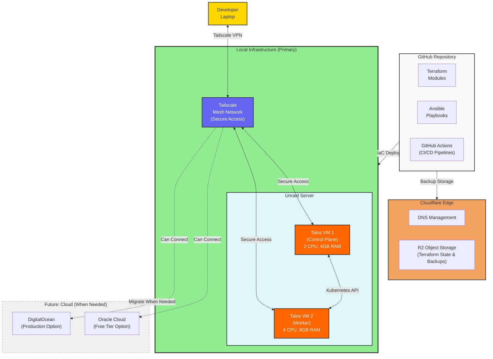

# Hybrid Cloud Kubernetes Infrastructure

> Infrastructure as Code for managing hybrid cloud Kubernetes environments using Terraform, Ansible, and GitHub Actions

[](https://www.terraform.io/)
[](https://www.ansible.com/)
[](https://kubernetes.io/)
[](https://fluxcd.io/)
[](https://github.com/features/actions)

## Overview

This repository contains Infrastructure as Code (IaC) for deploying and managing a hybrid cloud Kubernetes-centric infrastructure across multiple cloud providers and on-premise environments. It leverages:

- **Terraform** for infrastructure provisioning and declarative configuration
- **Ansible** for configuration management, automation, and routine operational tasks
- **GitHub Actions** for CI/CD pipeline automation with integrated secret management
- **Flux CD** for Kubernetes-native GitOps in `kube-system` and `kube-addons` namespaces
- **Kubernetes** for container orchestration across hybrid cloud environments

### Design Goals

- **Kubernetes First**: Prioritize rapid Kubernetes setup and hands-on learning
- **Cost Optimization**: Zero cost during learning phase, scalable to cloud when needed
- **Vendor Neutrality**: Avoid cloud provider lock-in through abstraction layers
- **Infrastructure as Code**: All infrastructure versioned and managed as code
- **Automation First**: Minimize manual operations through comprehensive automation
- **Security by Default**: Implement security best practices at every layer
- **GitOps Workflow**: Changes deployed through version-controlled pull requests

## Architecture



### Primary Infrastructure: Talos on Unraid

**Local Kubernetes Cluster**:

- **Platform**: Talos Linux on Unraid VMs
- **Configuration**: 2-node cluster (1 control plane + 1 worker)
- **Control Plane**: 2 vCPU, 4GB RAM, 50GB disk
- **Worker Node**: 4 vCPU, 8GB RAM, 100GB disk
- **Cost**: $0/month (local infrastructure only)
- **Access**: Tailscale mesh network for secure remote access

**Why Talos Linux**:

- **Production-Grade**: Secure, immutable Kubernetes OS used in production environments
- **API-Driven**: All operations via API (talosctl), no SSH access by design
- **Secure by Default**: Minimal attack surface, mTLS for all communication
- **Easy Management**: Simple configuration, automatic updates
- **Learning Focus**: Real Kubernetes experience without cloud complexity

**Why This Approach**:

- **Immediate Availability**: Start learning Kubernetes today, no cloud account approval delays
- **Zero Cost**: No monthly bills during learning and development phase
- **Full Control**: Complete control over infrastructure for experimentation
- **Cloud Ready**: Same Kubernetes workloads easily migrate to cloud when needed
- **Production Experience**: Talos provides production-quality Kubernetes locally

**Public Access via Hybrid Load Balancing**:

- **Cloudflare Tunnel** (Primary): FREE production-grade public access with DDoS protection
- **Ngrok** (Secondary): Development and testing, optional failover ($0-20/month)
- **No Cloud VMs Needed**: Direct tunnels from cloud edge to on-premises cluster
- **High Availability**: Multi-replica tunnels with automatic failover
- **Kubernetes Native**: Standard Ingress resources for routing

**Secure Access via Tailscale**:

- **Zero-config VPN**: Access cluster securely from anywhere
- **No Port Forwarding**: Tailscale handles NAT traversal automatically
- **WireGuard Encryption**: Strong encryption for all traffic
- **Multi-Device**: Access from laptop, desktop, mobile devices
- **Team Friendly**: Easy to grant access to team members

**Decision Rationale**:

- Infrastructure: [ADR-0016: Talos Linux on Unraid as Primary Infrastructure](docs/decisions/0016-talos-unraid-primary.md)
- Load Balancing: [ADR-0017: Hybrid Load Balancing with Cloudflare Tunnel and Ngrok](docs/decisions/0017-hybrid-load-balancing.md)

### Cloud Services (Supporting Role)

**Cloudflare R2**: Terraform state storage and backups (10GB free, zero egress)

**Future Cloud Options** (when production needs arise):

- **Oracle Cloud**: Always Free tier (4 OCPU, 24GB RAM) for cost-effective production
- **DigitalOcean**: Managed services and enterprise features when simplicity needed
- **Multi-Cloud**: Use Tailscale mesh to connect local and cloud infrastructure

## Quick Start

### Prerequisites

- **Talos CLI** (`talosctl`) >= 1.6.0 - Cluster management
- **kubectl** >= 1.28.0 - Kubernetes CLI
- **Terraform** >= 1.6.0 - Infrastructure as Code
- **Git** >= 2.40.0 - Version control
- **Unraid Server** - VM host platform (or any hypervisor capable of running VMs)
- **Tailscale Account** - Free account for secure access

### Installation

```bash
# Clone the repository
git clone https://github.com/shangkuei/infrastructure.git
cd infrastructure

# Install Talos CLI (macOS)
brew install siderolabs/tap/talosctl

# Install Talos CLI (Linux)
curl -sL https://talos.dev/install | sh

# Install kubectl (macOS)
brew install kubectl

# Install kubectl (Linux)
curl -LO "https://dl.k8s.io/release/$(curl -L -s https://dl.k8s.io/release/stable.txt)/bin/linux/amd64/kubectl"
sudo install -o root -g root -m 0755 kubectl /usr/local/bin/kubectl

# Verify installations
talosctl version
kubectl version --client
```

### Initial Setup

**Complete setup guide**: See [ADR-0016: Implementation Plan](docs/decisions/0016-talos-unraid-primary.md#implementation-plan) for detailed day-by-day setup instructions.

**Quick overview**:

1. **Create VMs on Unraid**:
   - Control Plane: 2 vCPU, 4GB RAM, 50GB disk
   - Worker: 4 vCPU, 8GB RAM, 100GB disk
   - Boot from Talos Linux ISO

2. **Generate Talos configuration**:

   ```bash
   talosctl gen config talos-home https://<control-plane-ip>:6443
   ```

3. **Apply configuration to nodes**:

   ```bash
   talosctl apply-config --insecure --nodes <control-plane-ip> --file controlplane.yaml
   talosctl apply-config --insecure --nodes <worker-ip> --file worker.yaml
   ```

4. **Bootstrap Kubernetes**:

   ```bash
   talosctl config endpoint <control-plane-ip>
   talosctl config node <control-plane-ip>
   talosctl bootstrap
   ```

5. **Get kubeconfig**:

   ```bash
   talosctl kubeconfig ./kubeconfig
   kubectl --kubeconfig=./kubeconfig get nodes
   ```

6. **Set up Tailscale** (for remote access):

   ```bash
   # Create account at https://login.tailscale.com/
   # Deploy Tailscale on cluster (see ADR-0016 Phase 2)
   # Install on your laptop/desktop
   ```

### Deploy Your First Application

```bash
# Deploy test application
kubectl create deployment nginx --image=nginx:latest
kubectl expose deployment nginx --port=80 --type=NodePort

# Check the service
kubectl get svc nginx

# Access via node IP and NodePort
curl http://<node-ip>:<nodeport>
```

## Repository Structure

```text
infrastructure/
├── terraform/              # Terraform configurations
│   ├── modules/           # Reusable modules
│   ├── environments/      # Environment-specific configs
│   └── providers/         # Cloud provider configurations
│
├── ansible/               # Ansible automation
│   ├── playbooks/        # Automation playbooks
│   ├── roles/            # Reusable roles
│   └── inventory/        # Host inventories
│
├── kubernetes/            # Kubernetes manifests (Flux GitOps)
│   ├── clusters/         # Cluster-specific Flux configurations
│   │   └── talos-home/  # Talos cluster configs
│   └── base/            # Base Kubernetes manifests
│       ├── kube-system/ # Core system components
│       └── kube-addons/ # Cluster addons
│
├── .github/              # GitHub Actions workflows
│   └── workflows/        # CI/CD pipelines
│
├── docs/                 # Documentation
│   ├── decisions/       # Architectural Decision Records
│   ├── research/        # Research and analysis
│   ├── runbooks/        # Operational procedures
│   └── architecture/    # Architecture diagrams
│
├── specs/               # Technical specifications
│   ├── network/        # Network specs
│   ├── security/       # Security requirements
│   ├── compute/        # Compute specs
│   └── storage/        # Storage specs
│
├── scripts/            # Utility scripts
├── tests/              # Automated tests
├── AGENTS.md           # AI assistant guidance
├── CLAUDE.md          # Claude Code specific guidance
└── README.md          # This file
```

## Environments

### Development

- **Purpose**: Testing and experimentation
- **Auto-Deploy**: Yes (on merge to `develop`)
- **Cost Optimization**: Aggressive (stop resources overnight)
- **Data**: Sample/synthetic data only

### Staging

- **Purpose**: Pre-production validation
- **Auto-Deploy**: No (manual trigger)
- **Cost Optimization**: Moderate
- **Data**: Anonymized production data

### Production

- **Purpose**: Live workloads
- **Auto-Deploy**: No (requires approval)
- **Cost Optimization**: Reserved instances
- **Data**: Production data with encryption

## Common Operations

### Infrastructure Management

```bash
# Plan changes (dry-run)
terraform plan -var-file=environments/production/terraform.tfvars

# Apply approved changes
terraform apply -var-file=environments/production/terraform.tfvars

# View current state
terraform show

# Import existing resources
terraform import module.network.digitalocean_vpc.main vpc-uuid-here
```

### Configuration Management

```bash
# Run playbook with check mode
ansible-playbook -i inventory/production playbooks/deploy/app.yml --check

# Deploy application
ansible-playbook -i inventory/production playbooks/deploy/app.yml

# Run maintenance tasks
ansible-playbook -i inventory/production playbooks/maintenance/update.yml

# Troubleshoot issues
ansible-playbook -i inventory/production playbooks/troubleshoot/diagnose.yml
```

### Kubernetes Operations

```bash
# Switch context to cluster
kubectl config use-context production-cluster

# View cluster resources
kubectl get nodes
kubectl get pods -A

# Deploy workload
kubectl apply -f k8s/manifests/

# Check logs
kubectl logs -f deployment/app-name
```

## CI/CD Pipeline

### Workflow Overview

1. **Pull Request**:
   - Terraform format check
   - Terraform validate
   - Terraform plan (comment on PR)
   - Ansible syntax check
   - Ansible lint
   - Security scan (tfsec, checkov)

2. **Merge to Develop**:
   - Deploy to development environment
   - Run integration tests
   - Notify team

3. **Merge to Main**:
   - Manual approval required
   - Deploy to staging
   - Run E2E tests
   - Manual approval for production
   - Deploy to production
   - Smoke tests

### Manual Workflows

```bash
# Trigger Terraform plan
gh workflow run terraform-plan --ref main

# Trigger deployment to staging
gh workflow run deploy-staging --ref main

# View workflow status
gh run list --workflow=terraform-plan
gh run watch
```

## Security

### Secrets Management

- **GitHub Secrets**: CI/CD credentials and API keys
- **Terraform Variables**: Sensitive configuration via encrypted `.tfvars`
- **Ansible Vault**: Encrypted playbook variables
- **Kubernetes Secrets**: Application secrets via External Secrets Operator

### Security Scanning

```bash
# Terraform security scan
tfsec terraform/
checkov -d terraform/

# Ansible security scan
ansible-lint --strict ansible/

# Container image scanning
trivy image myapp:latest

# Check for committed secrets
git secrets --scan
```

### Compliance

- **CIS Benchmarks**: Applied to all Kubernetes clusters
- **RBAC**: Least privilege access controls
- **Network Policies**: Segmentation and isolation
- **Encryption**: At-rest and in-transit encryption
- **Audit Logging**: All infrastructure changes logged

## Testing

### Local Testing

```bash
# Terraform tests
cd tests/terraform/network
go test -v

# Ansible tests (Molecule)
cd ansible/roles/kubernetes
molecule test

# Integration tests
cd tests/integration
./run-tests.sh
```

### CI Testing

- **Syntax Validation**: Automated on every commit
- **Security Scanning**: Automated on every PR
- **Integration Tests**: Automated on merge to develop
- **E2E Tests**: Automated before production deployment

## Documentation

### Architectural Decision Records (ADRs)

See [docs/decisions/](docs/decisions/) for design decisions and rationale.

**Infrastructure Tooling**:

- [ADR-0001: Infrastructure as Code Approach](docs/decisions/0001-infrastructure-as-code.md)
- [ADR-0002: Terraform as Primary IaC Tool](docs/decisions/0002-terraform-primary-tool.md)
- [ADR-0003: Ansible for Configuration Management](docs/decisions/0003-ansible-configuration-management.md)

**Infrastructure & Platform**:

- [ADR-0005: Kubernetes as Container Platform](docs/decisions/0005-kubernetes-container-platform.md)
- [ADR-0016: Talos Linux on Unraid as Primary Infrastructure](docs/decisions/0016-talos-unraid-primary.md) ⭐ **Current**
- [ADR-0017: Hybrid Load Balancing with Cloudflare Tunnel and Ngrok](docs/decisions/0017-hybrid-load-balancing.md) ⭐ **Current**
- [ADR-0009: Tailscale for Hybrid Cloud Networking](docs/decisions/0009-tailscale-hybrid-networking.md)

**Cloud Services**:

- [ADR-0004: Cloudflare DNS and Edge Services](docs/decisions/0004-cloudflare-dns-services.md)
- [ADR-0014: Cloudflare R2 for Terraform State Storage](docs/decisions/0014-cloudflare-r2-terraform-state.md)
- [ADR-0015: Oracle Cloud as Primary Provider](docs/decisions/0015-oracle-cloud-primary.md) (Superseded → Future option)
- [ADR-0013: DigitalOcean as Primary Cloud](docs/decisions/0013-digitalocean-primary-cloud.md) (Superseded → Future option)

**CI/CD & GitOps**:

- [ADR-0006: GitHub Actions for CI/CD](docs/decisions/0006-github-actions-cicd.md)
- [ADR-0007: GitOps Workflow](docs/decisions/0007-gitops-workflow.md)
- [ADR-0018: Flux for Kubernetes GitOps](docs/decisions/0018-flux-kubernetes-gitops.md) ⭐ **New**

**Security**:

- [ADR-0008: Secret Management Strategy](docs/decisions/0008-secret-management.md)

**SOPS Configuration**:

This repository uses **per-environment SOPS configuration** instead of a root `.sops.yaml`:

- `terraform/environments/talos-cluster/.sops.yaml` - For Terraform variables encryption
- `terraform/environments/talos-gitops/.sops.yaml` - For GitOps bootstrap secrets
- `kubernetes/overlays/flux-instance/*/sops.yaml` - For Kubernetes manifest encryption

This approach provides better security isolation and supports different age keys per environment.

### Runbooks

Operational procedures in [docs/runbooks/](docs/runbooks/):

- [0001: Cloudflare Operations](docs/runbooks/0001-cloudflare-operations.md) - DNS, R2 storage, CDN configuration
- Coming soon: Talos Operations - Cluster management, updates, troubleshooting

### Technical Specifications

Detailed specs in [specs/](specs/):

- Coming soon: Talos Cluster Specification - Node configuration, networking, storage
- [Cloudflare Services](specs/cloudflare/cloudflare-services.md) - Edge services configuration
- [Network Architecture](specs/network/README.md) - Network design and Tailscale mesh
- [Oracle Cloud Infrastructure](specs/oracle/oracle-cloud-infrastructure.md) - Future cloud option
- [DigitalOcean Infrastructure](specs/digitalocean/digitalocean-infrastructure.md) - Future cloud option

## Contributing

1. **Read the guides**:
   - [AGENTS.md](AGENTS.md): AI assistant guidance (vendor-neutral)
   - [CLAUDE.md](CLAUDE.md): Claude Code specific guidance
   - [CONTRIBUTING.md](CONTRIBUTING.md): Contribution workflow

2. **Create a feature branch**:

   ```bash
   git checkout -b feature/my-feature
   ```

3. **Make changes**:
   - Follow Terraform and Ansible conventions
   - Add tests for new functionality
   - Update documentation

4. **Test locally**:

   ```bash
   terraform fmt -recursive
   terraform validate
   ansible-lint ansible/
   ```

5. **Create pull request**:

   ```bash
   git push origin feature/my-feature
   gh pr create --title "Add my feature" --body "Description"
   ```

6. **Address review feedback**:
   - CI checks must pass
   - Terraform plan reviewed
   - Security scan passed
   - Approval from maintainers

## Troubleshooting

### Common Issues

**Terraformstate lock**:

```bash
# Force unlock (use with caution)
terraform force-unlock <lock-id>
```

**Ansible connection timeout**:

```bash
# Test connectivity
ansible all -m ping -i inventory/production

# Increase timeout
ansible-playbook playbooks/deploy/app.yml --timeout=60
```

**GitHub Actions failed**:

```bash
# View logs
gh run view <run-id> --log

# Re-run workflow
gh run rerun <run-id>
```

## Monitoring and Observability

- **Infrastructure Metrics**: DigitalOcean Monitoring, Prometheus, Grafana
- **Application Metrics**: Prometheus + Grafana
- **Logging**: ELK Stack (Elasticsearch, Logstash, Kibana)
- **Tracing**: Jaeger for distributed tracing
- **Alerting**: AlertManager with PagerDuty integration

## Cost Management

- **Resource Tagging**: Mandatory tags for all resources
- **Auto-Scaling**: Based on actual usage patterns
- **Reserved Instances**: For predictable workloads
- **Spot Instances**: For fault-tolerant workloads
- **Cost Monitoring**: Daily cost reports and budget alerts

## Support

- **Issues**: [GitHub Issues](https://github.com/shangkuei/infrastructure/issues)
- **Discussions**: [GitHub Discussions](https://github.com/shangkuei/infrastructure/discussions)
- **Documentation**: [docs/](docs/)
- **Runbooks**: [docs/runbooks/](docs/runbooks/)

## License

See [LICENSE](LICENSE) for licensing information.

## Acknowledgments

Built with:

- [Terraform](https://www.terraform.io/) by HashiCorp
- [Ansible](https://www.ansible.com/) by Red Hat
- [Kubernetes](https://kubernetes.io/) by Cloud Native Computing Foundation
- [GitHub Actions](https://github.com/features/actions) by GitHub

---

**Note**: This infrastructure is under active development. See [CHANGELOG.md](CHANGELOG.md) for version history and [ROADMAP.md](ROADMAP.md) for planned features.
