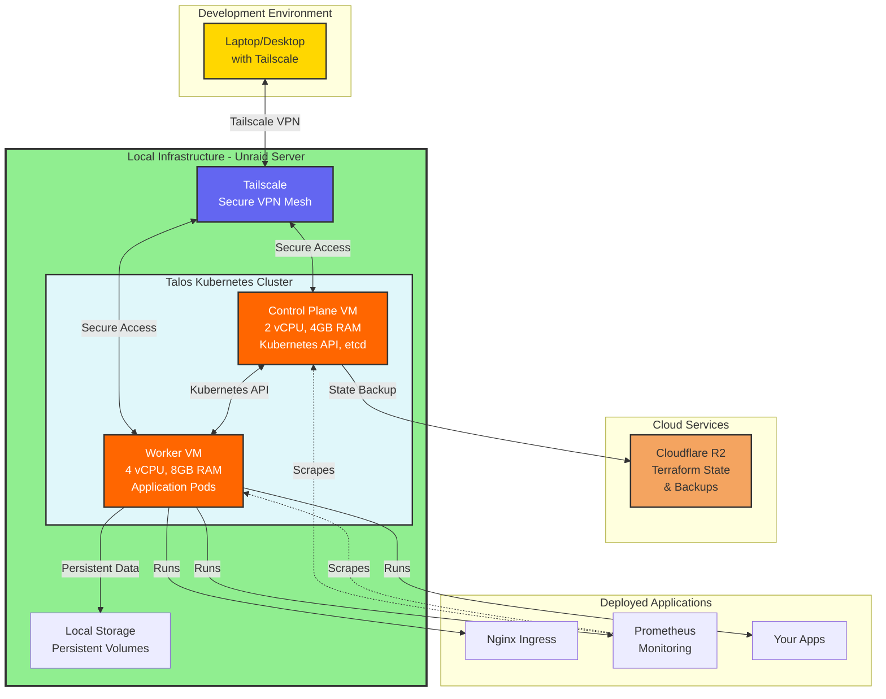
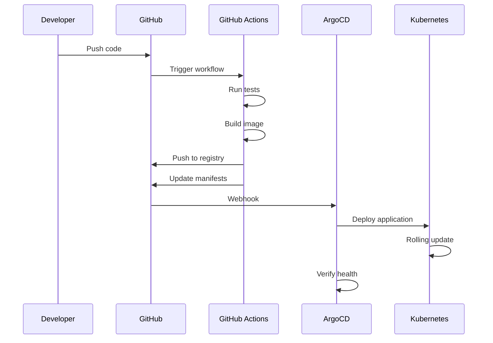
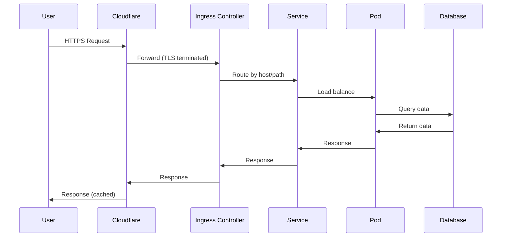

# Infrastructure Overview

High-level architecture diagram showing the local Kubernetes infrastructure with Talos Linux.

**Status**: Updated 2025-10-31 to reflect current Talos-based approach.

**Previous versions**: Oracle Cloud and DigitalOcean architectures are retained as future migration options.

## Current Architecture (Talos on Unraid)

### Current Setup Details

- **Platform**: Talos Linux VMs on Unraid server
- **Cluster Size**: 2 nodes (1 control plane, 1 worker)
- **Cost**: $0/month (local infrastructure)
- **Access**: Tailscale mesh network for secure remote access
- **Storage**: Local path provisioner for persistent volumes
- **State Management**: Cloudflare R2 for Terraform state and backups

### Why This Architecture

1. **Learning First**: Immediate Kubernetes access without cloud setup delays
2. **Zero Cost**: No monthly bills during development and learning
3. **Production-Like**: Talos provides production-quality Kubernetes experience
4. **Secure Access**: Tailscale VPN enables secure access from anywhere
5. **Cloud Ready**: Same workloads easily migrate to cloud when needed

## Components

### Cloud Infrastructure (DigitalOcean)

**Purpose**: Primary production environment for public-facing services

**Components**:

- **DOKS (DigitalOcean Kubernetes)**: Managed Kubernetes cluster
  - 3-node cluster (production)
  - Free control plane
  - Auto-scaling enabled
  - NYC3 region

- **DO Spaces**: S3-compatible object storage
  - Terraform state backend
  - Application file storage
  - Backup storage

- **DO Database**: Managed PostgreSQL
  - Automated backups
  - Point-in-time recovery
  - High availability

- **DO Container Registry**: Private Docker registry
  - Application images
  - Base images
  - Vulnerability scanning

### On-Premise Infrastructure

**Purpose**: Internal services, development, and disaster recovery

**Components**:

- **Talos Linux Cluster**: Immutable Kubernetes
  - Production-grade security
  - API-driven management
  - Automatic updates

- **Local Storage**: Persistent volumes
  - NFS/Ceph for shared storage
  - Local SSDs for performance

### DNS & CDN

**Cloudflare**:

- DNS management
- DDoS protection
- SSL/TLS termination
- Global CDN
- Load balancing between cloud/on-prem

### CI/CD Pipeline

**GitHub Actions**:

- Terraform plan/apply
- Ansible playbooks
- Container builds
- Security scanning

**ArgoCD**:

- GitOps deployment
- Automatic synchronization
- Rollback capabilities

### Monitoring & Observability

**Prometheus Stack**:

- Metrics collection
- Alerting
- Node exporter
- kube-state-metrics

**Grafana**:

- Visualization dashboards
- Alert management
- Unified UI for metrics and logs

**Loki**:

- Log aggregation
- Cost-effective storage (S3)
- LogQL queries

## Data Flow

### Deployment Flow

### User Request Flow

## Network Architecture

- **Cloud Network**: DigitalOcean VPC (10.100.0.0/16)
- **On-Prem Network**: Private network (192.168.0.0/16)
- **Hybrid Connectivity**: WireGuard VPN tunnel
- **Public Access**: Via Cloudflare load balancer

## Security

- **TLS Everywhere**: Cloudflare → Ingress → Services
- **Network Policies**: Pod-to-pod traffic control
- **RBAC**: Kubernetes role-based access control
- **Secrets Management**: Multi-layered approach (see ADR-0008)
- **Vulnerability Scanning**: Trivy for containers and IaC

## Disaster Recovery

- **Backups**: Velero for cluster state, automated DB backups
- **Failover**: Cloudflare can route to on-prem if cloud fails
- **RTO**: 2-4 hours for full cluster recovery
- **RPO**: 24 hours for cluster state, 1 hour for databases

## Scaling Strategy

### Horizontal Scaling

- Application pods: HPA based on CPU/memory
- Cluster nodes: Manual or cluster autoscaler

### Vertical Scaling

- Upgrade node sizes via Terraform
- Database tier upgrades for increased load

## Cost Optimization

- **Free Control Plane**: DOKS saves $73/month vs AWS EKS
- **Spot Instances**: Not yet implemented (future optimization)
- **Auto-scaling**: Scale down during low-traffic periods
- **Resource Limits**: Prevent waste via pod resource quotas

## Future Enhancements

- [ ] Multi-region deployment (if global user base grows)
- [ ] Service mesh (Linkerd) for advanced traffic management
- [ ] Automated cluster backups to multiple regions
- [ ] Cost monitoring and optimization automation
- [ ] Zero-trust networking with Cilium

## References

- [ADR-0001: Infrastructure as Code](../decisions/0001-infrastructure-as-code.md)
- [ADR-0005: Kubernetes as Container Platform](../decisions/0005-kubernetes-container-platform.md)
- [Network Topology](network-topology.md)
