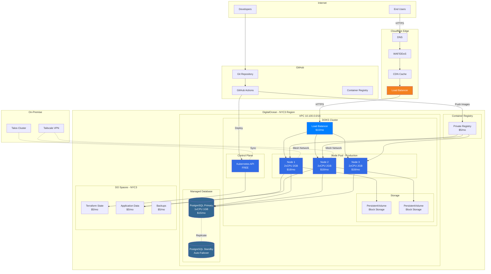
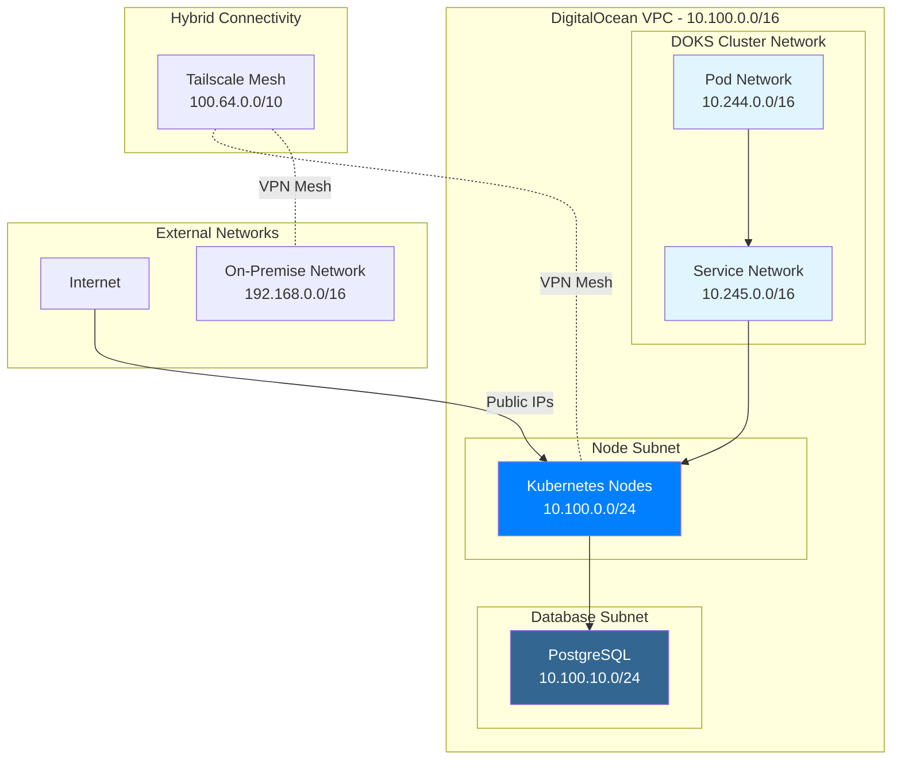

# DigitalOcean Infrastructure Architecture

Detailed architecture for DigitalOcean cloud infrastructure including Kubernetes, networking, storage, and integrations.

## Architecture Diagram



## Infrastructure Components

### 1. Virtual Private Cloud (VPC)

**Purpose**: Isolated private network for all DigitalOcean resources

**Configuration**:

- **IP Range**: `10.100.0.0/16` (65,534 usable IPs)
- **Region**: NYC3 (New York City 3)
- **DNS**: DigitalOcean managed DNS
- **Cost**: FREE

**Design Decisions**:

- Large CIDR block for future growth
- Private communication between resources (no public IPs needed)
- Integrated with DOKS networking

**Terraform Configuration**:

```hcl
resource "digitalocean_vpc" "main" {
  name     = "production-vpc-nyc3"
  region   = "nyc3"
  ip_range = "10.100.0.0/16"
}
```

### 2. DOKS (DigitalOcean Kubernetes Service)

**Purpose**: Managed Kubernetes cluster for containerized workloads

#### Control Plane

- **Managed By**: DigitalOcean (fully managed, no access)
- **Version**: Kubernetes 1.28+ (auto-upgrade available)
- **High Availability**: Multi-master setup by default
- **Cost**: FREE (major cost savings vs AWS EKS $73/mo)
- **Monitoring**: Integrated with DigitalOcean monitoring

#### Worker Nodes

**Production Node Pool**:

- **Size**: 3 nodes (for HA quorum)
- **Instance Type**: `s-2vcpu-2gb` (2 vCPU, 2GB RAM, 60GB SSD)
- **Cost per Node**: $18/month
- **Total Compute Cost**: $54/month
- **Auto-Scaling**: Disabled initially (manual scaling)
- **Auto-Upgrade**: Minor version auto-upgrade enabled

**Node Configuration**:

```hcl
resource "digitalocean_kubernetes_cluster" "production" {
  name    = "production-cluster-nyc3"
  region  = "nyc3"
  version = "1.28.2-do.0"
  vpc_uuid = digitalocean_vpc.main.id

  node_pool {
    name       = "production-pool"
    size       = "s-2vcpu-2gb"
    node_count = 3
    auto_scale = false

    labels = {
      environment = "production"
      workload    = "general"
    }

    tags = ["production", "kubernetes"]
  }
}
```

**Future Node Pools** (planned):

- **High-Memory Pool**: For memory-intensive applications
- **GPU Pool**: If ML workloads needed
- **Spot Pool**: For cost optimization on stateless workloads

#### Networking

**Pod Network**:

- **CIDR**: `10.244.0.0/16` (Kubernetes default)
- **CNI**: Cilium (DigitalOcean managed)
- **Network Policies**: Supported

**Service Network**:

- **CIDR**: `10.245.0.0/16`
- **Type**: ClusterIP, NodePort, LoadBalancer
- **DNS**: CoreDNS

**Ingress**:

- **Controller**: Nginx Ingress Controller
- **LoadBalancer**: DigitalOcean Load Balancer ($10/mo)
- **SSL/TLS**: cert-manager with Let's Encrypt
- **External DNS**: Integration with Cloudflare

### 3. Load Balancer

**Purpose**: Distribute traffic to Kubernetes nodes, SSL termination

**Configuration**:

- **Type**: DigitalOcean Managed Load Balancer
- **Algorithm**: Round robin
- **Health Checks**: HTTP/HTTPS endpoint checks
- **Sticky Sessions**: Optional (disabled by default)
- **SSL Termination**: Supported (optional, Cloudflare handles this)
- **Cost**: $10/month per LB

**Integration**:

- Automatically created by Kubernetes LoadBalancer service
- Managed via Kubernetes annotations
- Health checks configured via service

**Terraform Configuration**:

```hcl
# Created automatically via Kubernetes Service type: LoadBalancer
# Configured via annotations in Kubernetes manifests
```

### 4. Container Registry

**Purpose**: Private Docker image registry for application containers

**Configuration**:

- **Name**: `production-registry`
- **Region**: NYC3 (co-located with cluster)
- **Storage**: 500GB included ($5/mo base tier)
- **Additional Storage**: $0.02/GB/month
- **Vulnerability Scanning**: Included (Trivy integration)
- **Garbage Collection**: Automated (configurable)

**Access Control**:

- **Authentication**: DigitalOcean API token
- **Kubernetes Integration**: Auto-configured with DOKS
- **CI/CD Access**: GitHub Actions via token

**Terraform Configuration**:

```hcl
resource "digitalocean_container_registry" "production" {
  name                   = "production-registry"
  subscription_tier_slug = "basic"
  region                 = "nyc3"
}

resource "digitalocean_container_registry_docker_credentials" "production" {
  registry_name = digitalocean_container_registry.production.name
  write         = true
}
```

### 5. Managed Database (PostgreSQL)

**Purpose**: Production database for application data

**Configuration**:

- **Engine**: PostgreSQL 15
- **Size**: `db-s-1vcpu-1gb` (1 vCPU, 1GB RAM, 10GB SSD)
- **Cost**: $15/month
- **High Availability**: Optional standby node (+$15/mo)
- **Connection Pool**: Built-in PgBouncer
- **Connections**: 25 max (for basic tier)

**Backup Configuration**:

- **Frequency**: Daily automated backups
- **Retention**: 7 days (basic tier)
- **Point-in-Time Recovery**: Available
- **Backup Window**: 02:00-04:00 UTC
- **Backup Location**: Same region

**Security**:

- **VPC Integration**: Database in same VPC as DOKS
- **Firewall**: Restrict access to DOKS nodes only
- **Encryption**: At-rest encryption enabled
- **TLS**: Required for all connections
- **Credentials**: Managed via Kubernetes Secrets

**Terraform Configuration**:

```hcl
resource "digitalocean_database_cluster" "postgres" {
  name       = "production-postgres"
  engine     = "pg"
  version    = "15"
  size       = "db-s-1vcpu-1gb"
  region     = "nyc3"
  node_count = 1

  private_network_uuid = digitalocean_vpc.main.id
}

resource "digitalocean_database_firewall" "postgres" {
  cluster_id = digitalocean_database_cluster.postgres.id

  rule {
    type  = "k8s"
    value = digitalocean_kubernetes_cluster.production.id
  }
}
```

### 6. Spaces (Object Storage)

**Purpose**: S3-compatible object storage for state, backups, and application data

#### Terraform State Space

- **Name**: `terraform-state-nyc3`
- **Region**: NYC3
- **Cost**: $5/month (250GB storage + 1TB transfer)
- **Versioning**: Enabled
- **Access**: Private (Terraform only)

#### Application Data Space

- **Name**: `app-data-nyc3`
- **Region**: NYC3
- **Cost**: $5/month
- **Public Access**: Optional (via signed URLs)
- **CDN**: DigitalOcean CDN available

#### Backup Space

- **Name**: `backups-nyc3`
- **Region**: NYC3
- **Cost**: $5/month
- **Lifecycle**: Auto-delete old backups (>30 days)
- **Access**: Private (backup tools only)

**Terraform Configuration**:

```hcl
resource "digitalocean_spaces_bucket" "terraform_state" {
  name   = "terraform-state-nyc3"
  region = "nyc3"
  acl    = "private"

  versioning {
    enabled = true
  }
}

resource "digitalocean_spaces_bucket" "app_data" {
  name   = "app-data-nyc3"
  region = "nyc3"
  acl    = "private"

  cors_rule {
    allowed_headers = ["*"]
    allowed_methods = ["GET", "PUT"]
    allowed_origins = ["https://example.com"]
    max_age_seconds = 3600
  }
}
```

### 7. Block Storage (Volumes)

**Purpose**: Persistent storage for Kubernetes PersistentVolumes

**Configuration**:

- **Type**: SSD-backed block storage
- **Cost**: $0.10/GB/month
- **Minimum Size**: 1GB
- **Maximum Size**: 16TB per volume
- **Snapshots**: Available ($0.05/GB/month)
- **Resize**: Online expansion supported

**Integration**:

- **CSI Driver**: Automatically installed with DOKS
- **StorageClass**: `do-block-storage` (default)
- **Access Mode**: ReadWriteOnce (RWO)
- **Reclaim Policy**: Delete (configurable)

**Kubernetes Usage**:

```yaml
apiVersion: v1
kind: PersistentVolumeClaim
metadata:
  name: app-data-pvc
spec:
  accessModes:
    - ReadWriteOnce
  storageClassName: do-block-storage
  resources:
    requests:
      storage: 10Gi
```

### 8. Cloud Firewalls

**Purpose**: Network-level security for Droplets and Kubernetes nodes

**Configuration**:

- **Inbound Rules**: Explicit allow-list
- **Outbound Rules**: Allow all (default, can restrict)
- **Cost**: FREE
- **Management**: Terraform or DigitalOcean console

**Default Rules**:

```hcl
resource "digitalocean_firewall" "kubernetes" {
  name = "kubernetes-nodes"

  tags = ["kubernetes"]

  # Allow HTTP/HTTPS from Cloudflare
  inbound_rule {
    protocol         = "tcp"
    port_range       = "80"
    source_addresses = ["0.0.0.0/0", "::/0"]
  }

  inbound_rule {
    protocol         = "tcp"
    port_range       = "443"
    source_addresses = ["0.0.0.0/0", "::/0"]
  }

  # Allow Kubernetes node-to-node
  inbound_rule {
    protocol    = "tcp"
    port_range  = "1-65535"
    source_tags = ["kubernetes"]
  }

  # Allow all outbound
  outbound_rule {
    protocol              = "tcp"
    port_range            = "1-65535"
    destination_addresses = ["0.0.0.0/0", "::/0"]
  }

  outbound_rule {
    protocol              = "udp"
    port_range            = "1-65535"
    destination_addresses = ["0.0.0.0/0", "::/0"]
  }
}
```

## Network Architecture

### Network Topology



### Network Segmentation

| Network | CIDR | Purpose | Access |
|---------|------|---------|--------|
| **VPC** | 10.100.0.0/16 | Private cloud network | Internal only |
| **Node Subnet** | 10.100.0.0/24 | Kubernetes worker nodes | Limited public |
| **Pod Network** | 10.244.0.0/16 | Kubernetes pods | Internal only |
| **Service Network** | 10.245.0.0/16 | Kubernetes services | Internal only |
| **Database Subnet** | 10.100.10.0/24 | Managed databases | Internal only |
| **Tailscale** | 100.64.0.0/10 | VPN mesh network | Hybrid access |

### Traffic Flow

#### Ingress Traffic Flow

1. User → Cloudflare DNS (resolve domain)
2. User → Cloudflare Edge (DDoS protection, WAF)
3. Cloudflare → DigitalOcean Load Balancer (TLS terminated at Cloudflare)
4. Load Balancer → Nginx Ingress Controller (on Kubernetes nodes)
5. Ingress Controller → Service (ClusterIP)
6. Service → Pod (application container)
7. Pod → PostgreSQL (via private network)

#### Egress Traffic Flow

1. Pod → Service (ClusterIP for external API)
2. Service → Node (SNAT to node IP)
3. Node → Internet (via DO network)

#### Internal Traffic Flow (Pod-to-Database)

1. Pod → CoreDNS (service discovery)
2. Pod → Database Service Endpoint (private IP)
3. Database responds directly to Pod

## Cost Breakdown

### Monthly Costs (Production)

| Service | Configuration | Monthly Cost | Notes |
|---------|---------------|--------------|-------|
| **DOKS Control Plane** | Managed Kubernetes | **$0** | Free (vs $73 on AWS) |
| **Worker Nodes** | 3x s-2vcpu-2gb | **$54** | $18 each |
| **Load Balancer** | 1x LB | **$10** | HTTP/HTTPS |
| **PostgreSQL** | db-s-1vcpu-1gb | **$15** | Basic tier |
| **Container Registry** | Basic tier | **$5** | 500GB storage |
| **Spaces (State)** | 250GB storage | **$5** | Terraform backend |
| **Spaces (App Data)** | 250GB storage | **$5** | Application files |
| **Spaces (Backups)** | 250GB storage | **$5** | Backup storage |
| **Block Storage** | ~20GB volumes | **$2** | $0.10/GB |
| **VPC** | Private network | **$0** | Free |
| **Firewalls** | Cloud firewall | **$0** | Free |
| **Bandwidth** | 5TB included | **$0** | Overage $0.01/GB |
| | | | |
| **Total** | | **~$101/month** | Production baseline |

### Cost Comparison (3-Node Kubernetes)

| Provider | Control Plane | Nodes | Total |
|----------|---------------|-------|-------|
| **DigitalOcean** | $0 | $54 | **$54** |
| **AWS EKS** | $73 | $75 | **$148** |
| **GCP GKE** | $73 | $60 | **$133** |
| **Azure AKS** | $0 | $68 | **$68** |

### Cost Optimization Strategies

1. **Use Free Tier Services**:
   - Free control plane (DOKS)
   - Free VPC networking
   - Free cloud firewalls

2. **Right-Size Resources**:
   - Start with smallest node size
   - Monitor and scale up if needed
   - Use metrics to guide sizing

3. **Optimize Storage**:
   - Use object storage (Spaces) over block storage
   - Implement lifecycle policies for old data
   - Compress backups

4. **Bandwidth Management**:
   - Use Cloudflare CDN to reduce origin traffic
   - Cache static assets aggressively
   - Optimize image and asset sizes

5. **Database Optimization**:
   - Use connection pooling (built-in PgBouncer)
   - Evaluate read replicas only if needed
   - Monitor query performance

6. **Future Optimizations**:
   - Cluster autoscaling for variable loads
   - Spot/reserved instances (if available)
   - Multi-region cost analysis

## High Availability & Disaster Recovery

### High Availability Design

**Control Plane**:

- Multi-master Kubernetes (DigitalOcean managed)
- Automatic failover (DigitalOcean SLA: 99.99%)

**Worker Nodes**:

- 3 nodes across availability zones (if supported in region)
- Pod anti-affinity for critical workloads
- Rolling updates for zero-downtime deployments

**Database**:

- Optional: HA standby node (+$15/mo)
- Automatic failover in <60 seconds
- Connection pooling for resilience

**Load Balancer**:

- Managed by DigitalOcean (HA built-in)
- Automatic health checks
- Failover to healthy nodes

### Disaster Recovery Strategy

**RTO (Recovery Time Objective)**: 2-4 hours
**RPO (Recovery Point Objective)**: 24 hours (cluster), 1 hour (database)

**Backup Strategy**:

1. **Cluster State** (Velero):
   - Daily backups to Spaces
   - 30-day retention
   - Backup time: ~30 minutes

2. **Database**:
   - Automated daily backups (7-day retention)
   - Point-in-time recovery
   - Manual snapshots before major changes

3. **Configuration**:
   - All infrastructure in Terraform (Git)
   - All manifests in Git repositories
   - Secrets backed up (encrypted)

**Failover Scenarios**:

| Scenario | Detection | Action | RTO |
|----------|-----------|--------|-----|
| **Node failure** | Health checks | Auto-reschedule pods | 2-5 min |
| **Database failure** | Connection loss | Auto-failover to standby | 1-2 min |
| **Region outage** | Manual monitoring | Failover to on-premise | 2-4 hours |
| **Data corruption** | Manual detection | Restore from backup | 1-2 hours |

### Multi-Region Strategy (Future)

**Phase 1** (Current): Single region (NYC3)

- Good for North America users
- Simple operations
- Cost-effective

**Phase 2** (Future): Active-passive multi-region

- Primary: NYC3
- Secondary: SFO3 or AMS3
- Manual failover
- Cross-region backups

**Phase 3** (Future): Active-active multi-region

- Global load balancing (Cloudflare)
- Data replication
- Geographic routing

## Security Architecture

### Defense in Depth

```mermaid
graph LR
    Internet[Internet] -->|Layer 1| CF[Cloudflare<br/>DDoS, WAF]
    CF -->|Layer 2| FW[Cloud Firewall<br/>Network Rules]
    FW -->|Layer 3| LB[Load Balancer<br/>SSL/TLS]
    LB -->|Layer 4| Ingress[Ingress Controller<br/>HTTP Rules]
    Ingress -->|Layer 5| NetPol[Network Policies<br/>Pod-to-Pod]
    NetPol -->|Layer 6| RBAC[RBAC<br/>Authorization]
    RBAC -->|Layer 7| App[Application<br/>Auth/AuthZ]

    style CF fill:#f48120,color:#fff
    style FW fill:#ff6b6b,color:#fff
    style NetPol fill:#51cf66,color:#fff
    style RBAC fill:#51cf66,color:#fff
```



### Security Layers

**Layer 1: Cloudflare Edge**

- DDoS protection (unlimited)
- WAF (Web Application Firewall)
- Rate limiting
- Bot mitigation

**Layer 2: Cloud Firewall**

- Network-level filtering
- Allow-list based access
- Source IP restrictions
- Tag-based rules

**Layer 3: Load Balancer**

- TLS termination (optional)
- Health check based routing
- Connection limits

**Layer 4: Ingress Controller**

- HTTP/HTTPS routing
- Virtual host based routing
- Path-based routing
- Rate limiting (application level)

**Layer 5: Kubernetes Network Policies**

- Pod-to-pod traffic control
- Namespace isolation
- Default deny policies
- Explicit allow rules

**Layer 6: RBAC (Role-Based Access Control)**

- User authentication
- Service account permissions
- Namespace-based access
- Least privilege principle

**Layer 7: Application Security**

- Authentication (OAuth, JWT)
- Authorization (role-based)
- Input validation
- SQL injection protection

### Secrets Management

**Secret Storage**:

- Kubernetes Secrets (base64 encoded)
- Sealed Secrets (encrypted in Git)
- External Secrets Operator (future)

**Secret Rotation**:

- Database credentials: 90 days
- API tokens: 90 days
- TLS certificates: Auto-renew (Let's Encrypt)

**Access Control**:

- Secrets per namespace
- Pod service accounts
- Minimal RBAC permissions

### Compliance & Auditing

**Security Scanning**:

- Container image scanning (Trivy)
- Infrastructure scanning (tfsec, checkov)
- Dependency scanning (Dependabot)
- Kubernetes manifest scanning (kube-bench)

**Audit Logging**:

- Kubernetes audit logs (enabled)
- Application logs (Loki)
- Access logs (ingress controller)
- Database query logs (PostgreSQL)

**Regular Reviews**:

- Quarterly security audits
- Access review (monthly)
- Firewall rule review (monthly)
- Dependency updates (weekly)

## Monitoring & Observability

### Metrics (Prometheus)

- Cluster metrics (kube-state-metrics)
- Node metrics (node-exporter)
- Application metrics (custom exporters)
- Database metrics (postgres-exporter)

### Logging (Loki)

- Application logs
- Kubernetes events
- Ingress access logs
- System logs

### Visualization (Grafana)

- Infrastructure dashboards
- Application dashboards
- Alert management
- Log exploration

### Alerting

- Critical: PagerDuty / Email
- Warning: Email / Slack
- Info: Slack

## Integration Points

### Cloudflare Integration

- DNS management (all domains)
- CDN (static assets)
- DDoS protection
- Load balancing (failover to on-premise)

### GitHub Integration

- Source code repository
- CI/CD (GitHub Actions)
- Container registry (alternative to DO registry)
- Secrets management (GitHub Secrets)

### Tailscale Integration

- VPN mesh network
- Hybrid cloud connectivity
- Secure access to cluster
- On-premise integration

### Terraform Integration

- Infrastructure as Code
- State in DO Spaces
- Provider: digitalocean
- Modules for reusability

## Future Enhancements

### Short-term (1-3 months)

- [ ] Set up automated backups (Velero)
- [ ] Implement monitoring dashboards
- [ ] Configure alerting rules
- [ ] Add read replica for database (if needed)
- [ ] Implement network policies

### Medium-term (3-6 months)

- [ ] Multi-region backup strategy
- [ ] Cluster autoscaling
- [ ] Database query optimization
- [ ] Cost optimization automation
- [ ] Service mesh evaluation (Linkerd)

### Long-term (6-12 months)

- [ ] Multi-region deployment
- [ ] Active-active database replication
- [ ] Advanced monitoring (APM, tracing)
- [ ] Chaos engineering testing
- [ ] Compliance automation (SOC 2 prep)

## References

- [ADR-0013: DigitalOcean as Primary Cloud Provider](../decisions/0013-digitalocean-primary-cloud.md)
- [ADR-0005: Kubernetes as Container Platform](../decisions/0005-kubernetes-container-platform.md)
- [DigitalOcean Kubernetes Documentation](https://docs.digitalocean.com/products/kubernetes/)
- [DigitalOcean Terraform Provider](https://registry.terraform.io/providers/digitalocean/digitalocean/latest/docs)
- [DigitalOcean VPC Documentation](https://docs.digitalocean.com/products/networking/vpc/)
