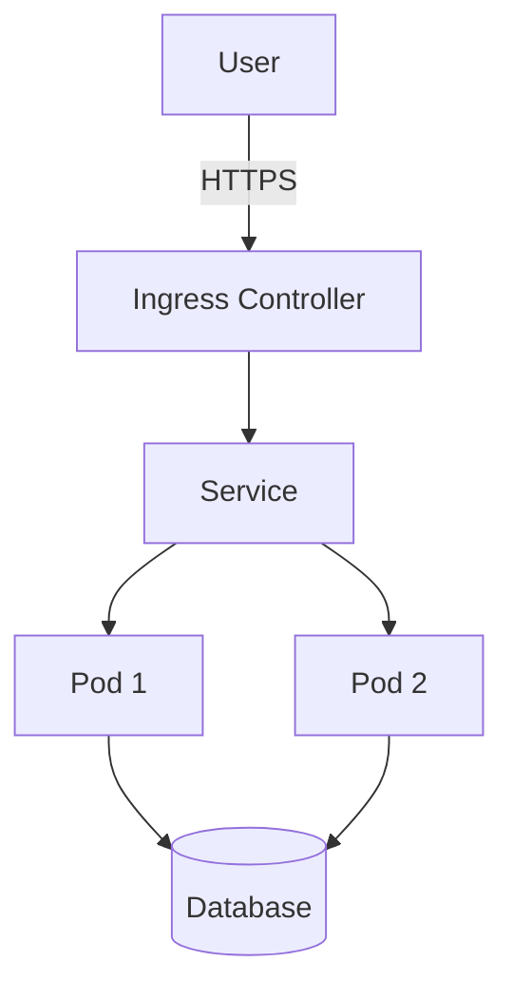
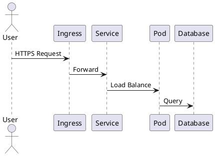

# Architecture Documentation

This directory contains system architecture diagrams and design documentation for the infrastructure project.

## Diagrams

### [Infrastructure Overview](0001-infrastructure-overview.md)

High-level architecture showing the relationship between cloud providers, on-premise infrastructure, and key services.

### [Network Topology](network-topology.md)

Network architecture including VPCs, subnets, firewalls, and hybrid cloud connectivity.

### [Kubernetes Architecture](kubernetes-architecture.md)

Kubernetes cluster architecture, networking, and service mesh configuration.

### [Data Flow](data-flow.md)

How data flows through the system from user requests to storage and back.

### [Security Architecture](security-architecture.md)

Security controls, zero-trust implementation, and access management.

## Diagram Tools

We use Mermaid and PlantUML for architecture diagrams:

- **Mermaid**: Markdown-based diagrams (preferred for simplicity)
- **PlantUML**: More complex UML diagrams when needed
- **Draw.io**: For detailed network diagrams (export as PNG/SVG)

## Creating Diagrams

### Mermaid Example

### PlantUML Example

## Diagram Standards

- **Naming**: Use descriptive names (infrastructure-overview.md, not diagram1.md)
- **Format**: Mermaid in Markdown files (renders in GitHub)
- **Updates**: Update diagrams when architecture changes
- **Versioning**: Keep old diagrams in version control
- **Documentation**: Include context and explanation with each diagram

## Quick Reference

| Diagram Type | Tool | Use Case |
|--------------|------|----------|
| **System Overview** | Mermaid flowchart | High-level architecture |
| **Network Topology** | Draw.io | Detailed networking |
| **Data Flow** | Mermaid sequence | Request/response flows |
| **Kubernetes** | Mermaid graph | Cluster architecture |
| **Security** | PlantUML | Security controls |

## Updating Diagrams

1. Edit diagram source (Mermaid/PlantUML/Draw.io)
2. Verify rendering (use GitHub preview or mermaid.live)
3. Commit changes with clear description
4. Link from relevant ADRs or specs

## Tools and Resources

- [Mermaid Live Editor](https://mermaid.live/)
- [PlantUML Online](https://www.plantuml.com/plantuml/)
- [Draw.io](https://app.diagrams.net/)
- [Kubernetes Icons](https://github.com/kubernetes/community/tree/master/icons)
- [Cloud Provider Icons](https://www.cloudcraft.co/)

## Architecture Documents

### Current State

- [Infrastructure Overview](0001-infrastructure-overview.md) - Current hybrid cloud setup
- [DigitalOcean Infrastructure](0002-digitalocean-infrastructure.md) - DigitalOcean cloud infrastructure architecture

### Future State

Architecture diagrams for planned features should be documented here before implementation.

## Maintenance

Architecture diagrams should be reviewed and updated:

- **When**: After major infrastructure changes
- **Who**: Architect or infrastructure team lead
- **How**: Update diagram source and verify rendering
- **Where**: Link updates in relevant ADRs and pull requests
