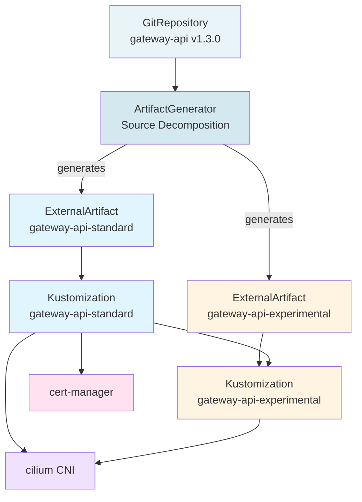

# Talos Cluster - shangkuei.xyz

GitOps configuration for the Talos Linux Kubernetes cluster managed by Flux.

## Cluster Information

- **Cluster Name**: shangkuei-xyz-talos
- **Kubernetes Version**: v1.34.1
- **Talos Version**: v1.11.3
- **Node Configuration**: 1 control plane + 1 worker
- **GitOps Tool**: Flux v2.7.3
- **Bootstrap Method**: Terraform → flux-operator → FluxInstance

## Architecture Overview

### Bootstrap Chain

```
Terraform Bootstrap:
  cert-manager (Helm) → OLMv1 webhooks require cert-manager
      ↓
  OLMv1 (kubectl manifests) → Operator Lifecycle Manager
      ↓
  flux-operator (OLM ClusterExtension) → Manages Flux
      ↓
  Flux (FluxInstance) → GitOps engine
      ↓
  Flux syncs this repository → kubernetes/clusters/shangkuei-xyz-talos/

GitOps-Managed Applications:
  - gateway-api → CRDs (no dependencies - foundational API extension)
  - cilium → CNI (depends on gateway-api - implements Gateway API)
  - cert-manager → Certificate management (depends on gateway-api - uses for HTTP01/TLS challenges)
```

### Why This Structure?

- **cert-manager before OLMv1**: OLMv1 admission webhooks require cert-manager
- **Terraform bootstraps infrastructure**: Installs foundational components that Flux needs
- **Flux manages applications**: All cluster workloads and ongoing lifecycle management
- **App-based organization**: Grouped by application (not namespace) since apps can have cluster-scoped resources

## Directory Structure

```
kubernetes/
├── base/                                      # Application definitions
│   ├── gateway-api/                           # Gateway API GitRepository (artifact source)
│   │   ├── gitrepository-gateway-api.yaml     # GitRepository pointing to upstream
│   │   └── kustomization.yaml                 # Includes GitRepository
│   ├── cert-manager/                          # Certificate automation (HelmRepository + HelmRelease)
│   ├── cilium/                                # CNI with Gateway API support (HelmRepository + HelmRelease)
│   ├── flux/                                  # (future: Flux self-management)
│   └── olmv1/                                 # (future: OLM self-management)
│
└── clusters/
    └── shangkuei-xyz-talos/
        ├── kustomization.yaml                           # Root: orchestrates all resources
        ├── kustomization-gateway-api-standard.yaml      # Standard CRDs (5 resources)
        ├── kustomization-gateway-api-experimental.yaml  # Experimental CRDs (TLSRoute)
        ├── kustomization-cert-manager.yaml              # Flux Kustomization CR for cert-manager
        └── kustomization-cilium.yaml                    # Flux Kustomization CR for Cilium
```

## Application Dependency Graph



**Reconciliation Order**:

1. **GitRepository** (`gateway-api`) fetches upstream v1.3.0
2. **ArtifactGenerator** decomposes GitRepository into ExternalArtifacts:
   - `gateway-api-standard` → standard CRDs (5 resources)
   - `gateway-api-experimental` → experimental CRDs (TLSRoute)
3. **Kustomizations** apply CRDs from ExternalArtifacts:
   - `gateway-api-standard` applies first (no dependencies)
   - `gateway-api-experimental` waits for standard
4. **Applications** reconcile in parallel:
   - `cilium` requires both standard + experimental (TLSRoute)
   - `cert-manager` requires standard only

**Source Decomposition Benefits**:

- Single GitRepository source for Gateway API
- Automatic artifact regeneration when upstream updates
- Independent revision tracking per CRD set
- Efficient reconciliation (only affected artifacts trigger updates)

## Version Compatibility Matrix

All component versions are **PINNED** for reproducibility and compatibility:

| Component | Version | Dependency | Notes |
|-----------|---------|------------|-------|
| Gateway API | v1.3.0 | None | Foundational CRDs |
| Cilium | 1.18.3 | Gateway API v1.3.x | Implements Gateway API for ingress |
| cert-manager | v1.19.1 | Gateway API v1.3.x | Experimental Gateway API support |

**Version Update Policy**:

- All versions use explicit tags/versions (no `latest`, `branch`, or `semver` ranges)
- Updates require testing compatibility between all three components
- Gateway API updates may require coordinated updates to both Cilium and cert-manager

## Managed Applications

### gateway-api

**GitRepository Source**:

- **Type**: GitRepository (artifact source)
- **Source**: https://github.com/kubernetes-sigs/gateway-api (upstream GitHub)
- **Version**: v1.3.0 (pinned tag)
- **Deployed via**: `kubernetes/base/gateway-api/gitrepository-gateway-api.yaml`

**ArtifactGenerator** (Source Decomposition):

- **Type**: ArtifactGenerator (Flux extension)
- **Source**: GitRepository `gateway-api`
- **Generates**: 2 ExternalArtifacts from single upstream source
- **Deployed via**: `kubernetes/base/gateway-api/artifactgenerator-gateway-api.yaml`

**ExternalArtifact: gateway-api-standard**:

- **Type**: ExternalArtifact (generated by ArtifactGenerator)
- **Content**: Standard CRDs from `config/crd/standard/`
- **Resources**:
  - GatewayClass
  - Gateway
  - HTTPRoute
  - GRPCRoute
  - ReferenceGrant
- **Revision**: Computed from artifact content (`latest@sha256:<hash>`)

**ExternalArtifact: gateway-api-experimental**:

- **Type**: ExternalArtifact (generated by ArtifactGenerator)
- **Content**: Experimental CRDs from `config/crd/experimental/`
- **Resources**:
  - TLSRoute (required by Cilium)
- **Revision**: Computed from artifact content (`latest@sha256:<hash>`)

**Kustomization: gateway-api-standard**:

- **Type**: Kustomization → ExternalArtifact
- **Dependencies**: None (foundational)
- **Health Checks**: All 5 standard CRDs validated

**Kustomization: gateway-api-experimental**:

- **Type**: Kustomization → ExternalArtifact
- **Dependencies**: gateway-api-standard
- **Health Checks**: TLSRoute CRD validated

### cert-manager

- **Type**: HelmRelease
- **Chart**: jetstack/cert-manager v1.19.1
- **Namespace**: cert-manager
- **Features**:
  - Automated certificate management
  - Gateway API integration (experimental)
  - DNS01 challenge support (Cloudflare DNS)
  - Certificate ownership references
- **Dependencies**: gateway-api-standard (uses standard CRDs for HTTP01/TLS challenges)
- **Health Checks**: cert-manager, cert-manager-webhook, cert-manager-cainjector deployments

### cilium

- **Type**: HelmRelease
- **Chart**: cilium/cilium 1.18.3
- **Namespace**: kube-system
- **Features**:
  - CNI with Gateway API implementation
  - Hubble observability (UI + relay)
  - kube-proxy replacement
  - Talos-optimized configuration (cgroup, k8sServicePort)
- **Dependencies**: gateway-api-standard + gateway-api-experimental (requires TLSRoute for full Gateway API support)
- **Health Checks**: cilium DaemonSet, cilium-operator Deployment

## Deployment and Operations

### Initial Deployment

1. **Bootstrap via Terraform**:

   ```bash
   cd terraform/environments/gitops
   terraform init
   terraform apply
   ```

2. **Commit Kubernetes manifests**:

   ```bash
   git add kubernetes/
   git commit -m "feat(kubernetes): add Flux GitOps configuration"
   git push origin main
   ```

3. **Flux automatically reconciles**:
   - Detects new commit (polls every 5 minutes)
   - Applies Kustomizations in dependency order
   - Validates health checks before proceeding

### Monitoring

```bash
# Check Flux system status
flux check

# Watch all Flux resources
flux get all -A

# Check Kustomization status
kubectl get kustomization -n flux-system

# Check individual applications
flux get kustomization gateway-api
flux get kustomization cert-manager
flux get kustomization cilium

# Check HelmReleases
kubectl get helmrelease -A

# Verify application health
kubectl get crd | grep gateway.networking.k8s.io
kubectl get pods -n cert-manager
kubectl get pods -n kube-system -l k8s-app=cilium
```

### Manual Reconciliation

```bash
# Force reconcile entire cluster
flux reconcile kustomization flux-system --with-source

# Reconcile specific application
flux reconcile kustomization gateway-api
flux reconcile kustomization cert-manager
flux reconcile kustomization cilium

# Suspend/resume reconciliation
flux suspend kustomization cilium
flux resume kustomization cilium
```

### Troubleshooting

```bash
# Check Kustomization logs
flux logs --kind=Kustomization --name=cilium

# Check HelmRelease logs
flux logs --kind=HelmRelease --name=cilium -n kube-system

# Describe Kustomization for detailed status
kubectl describe kustomization cilium -n flux-system

# Check Flux events
kubectl get events -n flux-system --sort-by='.lastTimestamp'

# Validate manifests locally before committing
cd kubernetes/clusters/shangkuei-xyz-talos
kustomize build .
```

### Common Issues

#### Kustomization Fails with "path not found"

**Symptom**: `kustomization path not found: stat /tmp/kustomization-xxx/kubernetes/base/cilium: no such file or directory`

**Cause**: Git repository not committed or Flux pointing to wrong path

**Solution**:

```bash
git status  # Verify changes are committed
flux get source git flux-system  # Check Git sync status
```

#### HelmRelease Fails to Install

**Symptom**: `install retries exhausted` or `timeout waiting for condition`

**Cause**: Missing dependencies or resource constraints

**Solution**:

```bash
# Check dependencies are ready
kubectl get kustomization -n flux-system

# Check HelmRelease status
kubectl describe helmrelease cilium -n kube-system

# Check pod events
kubectl get events -n kube-system --field-selector involvedObject.name=cilium-xxx
```

#### CRDs Not Installing

**Symptom**: Gateway API CRDs not found

**Cause**: GitRepository not syncing or path incorrect

**Solution**:

```bash
# Check GitRepository status
kubectl get gitrepository gateway-api -n flux-system -o yaml

# Manually verify upstream
curl -sL https://github.com/kubernetes-sigs/gateway-api/archive/refs/tags/v1.2.0.tar.gz | tar -tzf - | grep crd/standard
```

## Adding New Applications

1. **Create application directory**:

   ```bash
   mkdir kubernetes/base/my-app
   ```

2. **Add Kubernetes manifests**:

   ```bash
   # Create HelmRelease, GitRepository, or plain manifests
   # Add kustomization.yaml
   ```

3. **Create Flux Kustomization CR**:

   ```bash
   cat > kubernetes/clusters/shangkuei-xyz-talos/kustomization-my-app.yaml <<EOF
   ---
   apiVersion: kustomize.toolkit.fluxcd.io/v1
   kind: Kustomization
   metadata:
     name: my-app
     namespace: flux-system
   spec:
     interval: 30m
     timeout: 10m
     prune: true
     wait: true
     sourceRef:
       kind: GitRepository
       name: flux-system
       namespace: flux-system
     path: ./kubernetes/base/my-app
     dependsOn:
       - name: cilium  # Add dependencies as needed
   EOF
   ```

4. **Update cluster kustomization**:

   ```bash
   # Add to kubernetes/clusters/shangkuei-xyz-talos/kustomization.yaml
   resources:
     - kustomization-my-app.yaml
   ```

5. **Commit and push**:

   ```bash
   git add kubernetes/
   git commit -m "feat(kubernetes): add my-app application"
   git push origin main
   ```

## Configuration Management

### SOPS Encryption

Sensitive values are encrypted using SOPS with age encryption. **Important**: Only the `data`,
`stringData`, or `string` sections of Kubernetes secrets are encrypted. The metadata, kind, and
apiVersion fields remain in plaintext, as required by kustomize-controller.

```bash
# Option 1: Use the cluster Makefile (recommended - handles encryption automatically)
cd kubernetes/clusters/shangkuei-xyz-talos
make secret-create NAME=my-secret NAMESPACE=my-namespace

# Option 2: Manual encryption with .sops.yaml configuration
# First create a .sops.yaml with encrypted_regex configuration:
cat > .sops.yaml <<EOF
creation_rules:
  - path_regex: .*\.(yaml|yml)$
    encrypted_regex: '^(data|stringData)$'
    age: $(cat ~/.config/sops/age/gitops-flux.txt | grep public | cut -d: -f2)
EOF

# Then encrypt the secret
sops --encrypt kubernetes/base/my-app/secret.yaml > kubernetes/base/my-app/secret.enc.yaml

# Flux automatically decrypts using the sops-age secret in flux-system namespace
```

**Why Partial Encryption?**:

- Flux kustomize-controller needs to read metadata before decryption
- Ensures compatibility with Kubernetes Secret specifications
- Follows Flux SOPS best practices
- Only sensitive data (credentials, tokens) is encrypted
- The `encrypted_regex` in `.sops.yaml` ensures consistent encryption behavior

### Version Updates

**Update Gateway API**:

```yaml
# Edit kubernetes/base/gateway-api/gitrepository-gateway-api.yaml
spec:
  ref:
    tag: v1.3.0  # Update version
```

**Update cert-manager**:

```yaml
# Edit kubernetes/base/cert-manager/helmrelease-cert-manager.yaml
spec:
  chart:
    spec:
      version: v1.20.0  # Update version
```

**Update Cilium**:

```yaml
# Edit kubernetes/base/cilium/helmrelease-cilium.yaml
spec:
  chart:
    spec:
      version: 1.19.0  # Update version
```

## References

- [Flux Documentation](https://fluxcd.io/flux/)
- [Talos Linux Documentation](https://www.talos.dev/)
- [Gateway API Documentation](https://gateway-api.sigs.k8s.io/)
- [cert-manager Documentation](https://cert-manager.io/)
- [Cilium Documentation](https://docs.cilium.io/)
- [Project Infrastructure README](../../README.md)
- [Talos Cluster Specification](../../../specs/talos/talos-cluster-specification.md)
