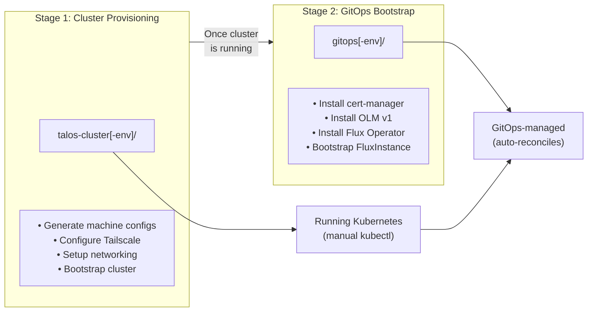

# Terraform Environments

This directory contains Terraform environments for managing the infrastructure at different lifecycle stages.

## Environment Overview

This infrastructure uses a **two-stage approach** for managing Talos Kubernetes clusters:



**Environment Pairs:**

| Cluster Environment | GitOps Environment |
|---------------------|-------------------|
| `talos-cluster/` | `gitops/` |
| `talos-cluster-shangkuei-dev/` | `gitops-shangkuei-dev/` |

## Directory Structure

```
terraform/environments/
├── README.md                    # This file - Environment overview
│
├── talos-cluster/               # Production: Cluster Configuration
├── gitops/                # Production: GitOps Bootstrap
│
├── talos-cluster-shangkuei-dev/ # Dev: Cluster Configuration
├── gitops-shangkuei-dev/  # Dev: GitOps Bootstrap (future)
│
└── r2-terraform-state/          # Cloudflare R2 State Backend
```

Each cluster environment pair follows this structure:

```
talos-cluster[-<env>]/           # Stage 1: Cluster Configuration Generator
├── main.tf                      # Talos machine config generation
├── variables.tf                 # Cluster configuration variables
├── outputs.tf                   # Generated configs and deployment info
├── Makefile                     # Deployment automation commands
├── README.md                    # Comprehensive setup and usage guide
├── .sops.yaml                   # SOPS config (talos-cluster age key)
├── terraform.tfvars.enc         # Encrypted cluster variables
├── backend.hcl.enc              # Encrypted R2 backend config
└── generated/                   # Generated Talos configs (gitignored)

gitops[-<env>]/            # Stage 2: GitOps Bootstrap
├── main.tf                      # Flux Operator installation via OLM
├── variables.tf                 # GitOps configuration variables
├── outputs.tf                   # Flux installation info
├── Makefile                     # Flux management commands
├── README.md                    # Bootstrap and operation guide
├── .sops.yaml                   # SOPS config (gitops age keys)
├── terraform.tfvars.enc         # Encrypted GitOps variables
└── backend.hcl.enc              # Encrypted R2 backend config
```

## Environment Purposes

### [talos-cluster-shangkuei-dev](talos-cluster-shangkuei-dev/) - Cluster Configuration Generator

**What it does**:

- ✅ Generates Talos machine configurations per node
- ✅ Configures Tailscale mesh networking integration
- ✅ Manages cluster secrets and certificates with SOPS
- ✅ Provides Makefile automation for deployment
- ✅ Supports KubePrism HA load balancer configuration
- ✅ Generates Cilium CNI Helm values

**What it does NOT do**:

- ❌ Does not deploy VMs (you manage VMs separately)
- ❌ Does not apply configs automatically (use Makefile commands)
- ❌ Does not bootstrap cluster (use `make bootstrap`)
- ❌ Does not manage running cluster resources

**When to use**:

- Setting up a new Talos cluster
- Updating cluster configurations
- Adding/removing nodes
- Changing CNI or networking settings
- Upgrading Talos/Kubernetes versions

**Key Commands**:

```bash
cd terraform/environments/talos-cluster-shangkuei-dev
make apply              # Generate configurations
make apply-configs      # Apply configs to nodes
make bootstrap          # Bootstrap Kubernetes
make health             # Check cluster status
```

### [gitops-shangkuei-dev](gitops-shangkuei-dev/) - GitOps Bootstrap

**What it does**:

- ✅ Installs cert-manager for TLS management
- ✅ Installs OLM v1 (Operator Lifecycle Manager)
- ✅ Deploys Flux Operator via OLM ClusterExtension
- ✅ Creates FluxInstance for GitOps configuration
- ✅ Sets up SOPS age secret for encrypted manifests
- ✅ Configures Git repository sync with GitHub

**What it does NOT do**:

- ❌ Does not manage cluster infrastructure (that's talos-cluster-shangkuei-dev)
- ❌ Does not handle day-to-day Kubernetes deployments (Flux does)
- ❌ Does not run repeatedly (one-time bootstrap only)

**When to use**:

- After cluster is running and healthy (post talos-cluster-shangkuei-dev)
- Setting up GitOps for the first time
- Migrating to GitOps workflow
- Disaster recovery (rebuilding GitOps components)

**Key Commands**:

```bash
cd terraform/environments/gitops-shangkuei-dev
make init               # Initialize Terraform
make apply              # Bootstrap Flux (phased deployment)
make flux-check         # Verify Flux installation
make flux-reconcile     # Force immediate sync
```

### [r2-terraform-state](r2-terraform-state/) - State Backend (Optional)

**What it does**:

- ✅ Provisions Cloudflare R2 bucket for Terraform state
- ✅ Configures state locking and encryption
- ✅ Provides backend configuration for other environments

**When to use**:

- Setting up remote state for team collaboration
- Enabling state locking and versioning
- Centralizing state storage

## Complete Deployment Workflow

### Prerequisites

- Unraid (or other hypervisor) with VMs created and booted from Talos ISO
- Tailscale account and auth key
- GitHub repository with kubernetes/ manifests
- age and SOPS installed locally

### Step-by-Step Deployment

#### **Phase 1: Provision Cluster** (`talos-cluster-shangkuei-dev/`)

```bash
# 1. Setup SOPS encryption
cd terraform/environments/talos-cluster-shangkuei-dev
make age-keygen                          # Generate age encryption key
# Update .sops.yaml with public key

# 2. Configure cluster
cp terraform.tfvars.example terraform.tfvars
# Edit terraform.tfvars with:
#   - Node IPs (physical and Tailscale)
#   - Tailscale auth key
#   - Cluster name and settings

# 3. Encrypt and apply
make encrypt-tfvars                      # Encrypt sensitive variables
terraform init                           # Initialize Terraform
terraform apply                          # Generate configurations

# 4. Deploy to nodes
make apply-configs INSECURE=true         # Initial config application
# Wait ~2 minutes for Tailscale registration
# Update terraform.tfvars with real Tailscale IPs
terraform apply                          # Regenerate with real IPs
make apply-configs                       # Reapply (secure mode)

# 5. Bootstrap Kubernetes
make bootstrap                           # Initialize cluster
make health                              # Verify cluster health
make kubeconfig                          # Retrieve kubeconfig

# 6. Deploy CNI (if using Cilium)
make deploy-cilium                       # Deploy Cilium via Helm
```

**Result**: Running Kubernetes cluster accessible via kubectl

#### **Phase 2: Enable GitOps** (`gitops-shangkuei-dev/`)

```bash
# 1. Setup SOPS encryption (two keys: Terraform + Flux)
cd terraform/environments/gitops-shangkuei-dev
make age-keygen                          # Generate both age keys
# Update .sops.yaml with Flux public key

# 2. Configure GitOps
cp terraform.tfvars.example terraform.tfvars
# Edit terraform.tfvars with:
#   - Kubernetes credentials (from talos-cluster-shangkuei-dev)
#   - GitHub token and repository
#   - Flux configuration

# 3. Encrypt and apply (phased deployment)
make encrypt-tfvars                      # Encrypt variables
terraform init                           # Initialize Terraform

# Phase 1: cert-manager + OLM v1
terraform apply                          # First apply (may fail - expected)
kubectl wait --for=condition=Available deployment/cert-manager -n cert-manager --timeout=5m
kubectl wait --for=condition=Available deployment/operator-controller-controller-manager -n olmv1-system --timeout=5m

# Phase 2: ClusterCatalog (uncomment in main.tf)
terraform apply
kubectl wait --for=condition=Serving clustercatalog/operatorhubio --timeout=5m

# Phase 3: Flux Operator (uncomment in main.tf)
terraform apply
kubectl wait --for=condition=Installed clusterextension/flux-operator --timeout=10m

# Phase 4: FluxInstance (uncomment in main.tf)
terraform apply
kubectl wait --for=condition=Ready fluxinstance/flux -n flux-system --timeout=10m

# 4. Verify GitOps
make flux-check                          # Verify Flux components
kubectl -n flux-system get gitrepository # Check Git sync
kubectl -n flux-system get kustomization # Check reconciliation
```

**Result**: GitOps-enabled cluster auto-syncing from Git

#### **Phase 3: Deploy Applications** (`kubernetes/`)

```bash
# 1. Add manifests to repository
cd kubernetes/base/kube-addons/
# Create your manifests...

# 2. Update kustomization
# Edit kustomization.yaml to include new resources

# 3. Commit and push
git add .
git commit -m "feat(kube-addons): add new application"
git push

# 4. Monitor deployment
flux reconcile kustomization kube-addons --with-source
kubectl -n flux-system get kustomization -w
```

**Result**: Applications automatically deployed via GitOps

## Environment Independence

### talos-cluster-shangkuei-dev Environment

- **Not a module**: Manages ONE cluster, not designed for module reuse
- **Self-contained**: All config generation logic in one place
- **Reason**: Single cluster use case, avoid over-complexity

### gitops-shangkuei-dev Environment

- **Not a module**: Bootstraps ONE cluster's GitOps
- **One-time setup**: Run once per cluster, Flux takes over
- **Reason**: Simple bootstrap pattern, no reuse needed

**Future Consideration**: If managing multiple clusters, consider converting to reusable modules.

## SOPS Secret Management

This infrastructure uses **two separate age keys** for different encryption contexts:

### Key 1: Terraform Secrets (`talos-cluster.txt`)

**Purpose**: Encrypt Terraform configuration files
**Used by**: talos-cluster-shangkuei-dev environment
**Files encrypted**:

- `terraform.tfvars.enc` (Tailscale auth key, node configs)
- `backend.hcl.enc` (R2 credentials)

**Location**: `~/.config/sops/age/talos-cluster.txt`

### Key 2: Flux Secrets (`gitops-flux.txt`)

**Purpose**: Encrypt Kubernetes manifests in Git
**Used by**: gitops-shangkuei-dev environment and Flux
**Files encrypted**:

- Kubernetes secrets in `kubernetes/` directory
- Any SOPS-encrypted YAML manifests

**Deployed to**: Kubernetes as `sops-age` secret in `flux-system` namespace
**Location**: `~/.config/sops/age/gitops-flux.txt`

### Key Management Workflow

```bash
# Generate keys
cd terraform/environments/talos-cluster-shangkuei-dev
make age-keygen                          # Generates talos-cluster.txt

cd terraform/environments/gitops-shangkuei-dev
make age-keygen                          # Generates gitops.txt + gitops-flux.txt

# View keys
make age-info                            # Shows both keys and usage

# Encrypt Terraform files (uses talos-cluster/gitops key)
make encrypt-tfvars
make encrypt-backend

# Encrypt Kubernetes manifests (uses Flux key via .sops.yaml)
sops -e --in-place kubernetes/secrets/my-secret.yaml
```

## Documentation

Each environment has comprehensive README documentation:

- **[talos-cluster-shangkuei-dev/README.md](talos-cluster-shangkuei-dev/README.md)** (220 lines)
  - Complete setup guide with prerequisites
  - Two-phase deployment workflow
  - Tailscale networking and KubePrism HA
  - SOPS secret management
  - Troubleshooting and operations
  - Makefile command reference

- **[gitops-shangkuei-dev/README.md](gitops-shangkuei-dev/README.md)** (1098 lines)
  - Phased deployment instructions
  - OLM v1 and Flux Operator setup
  - FluxInstance configuration
  - SOPS integration with Flux
  - GitOps workflow examples
  - Troubleshooting guide

- **[r2-terraform-state/README.md](r2-terraform-state/README.md)**
  - R2 backend setup
  - State migration guide
  - Backend configuration

## Architecture Decisions

Related ADRs:

- **[ADR-0016](../../docs/decisions/0016-talos-unraid-primary.md)**: Talos Linux on Unraid - Infrastructure choice
- **[ADR-0018](../../docs/decisions/0018-flux-kubernetes-gitops.md)**: Flux for Kubernetes GitOps - GitOps strategy
- **[ADR-0008](../../docs/decisions/0008-secret-management.md)**: SOPS Secret Management - Encryption approach

## Common Operations

### Cluster Operations (talos-cluster-shangkuei-dev)

```bash
# Check cluster health
make health

# List nodes and pods
make nodes
make pods

# Upgrade Kubernetes
make upgrade-k8s VERSION=v1.32.0

# Upgrade Talos
make upgrade-talos VERSION=v1.9.0 NODE=<ip>

# Add worker node
# 1. Update terraform.tfvars with new node
# 2. terraform apply
# 3. make apply-configs NODE=<new-node>
```

### GitOps Operations (gitops-shangkuei-dev)

```bash
# Check Flux status
make flux-check

# Force reconciliation
make flux-reconcile

# View Flux logs
make flux-logs

# Upgrade Flux
# 1. Update flux_version in terraform.tfvars
# 2. terraform apply
```

### Secret Operations

```bash
# Encrypt new Terraform vars
make encrypt-tfvars

# Rotate age keys
make age-keygen
# Update .sops.yaml with new public key
make encrypt-tfvars    # Re-encrypt with new key
```

## Troubleshooting

### Cluster Not Bootstrapping

```bash
cd terraform/environments/talos-cluster-shangkuei-dev
make health                              # Check Talos services
talosctl -n <node> logs kubelet          # Check kubelet logs
talosctl -n <node> get members           # Verify cluster membership
```

### GitOps Not Syncing

```bash
cd terraform/environments/gitops-shangkuei-dev
make flux-check                          # Verify Flux health
kubectl -n flux-system get gitrepository # Check Git connection
kubectl -n flux-system logs -l app=source-controller --tail=50
```

### SOPS Decryption Failing

```bash
# Verify age key exists
ls -la ~/.config/sops/age/

# Test decryption
sops -d terraform.tfvars.enc

# Check public key in .sops.yaml matches
cat ~/.config/sops/age/talos-cluster.txt.pub
```

## Getting Help

- **Talos**: [Talos Documentation](https://www.talos.dev/)
- **Flux**: [Flux CD Documentation](https://fluxcd.io/)
- **SOPS**: [SOPS Documentation](https://github.com/getsops/sops)
- **This Repository**: [GitHub Issues](https://github.com/shangkuei/infrastructure/issues)

## References

- [Main README](../../README.md)
- [Talos Cluster Specification](../../specs/talos/talos-cluster-specification.md)
- [Architecture Decisions](../../docs/decisions/README.md)
